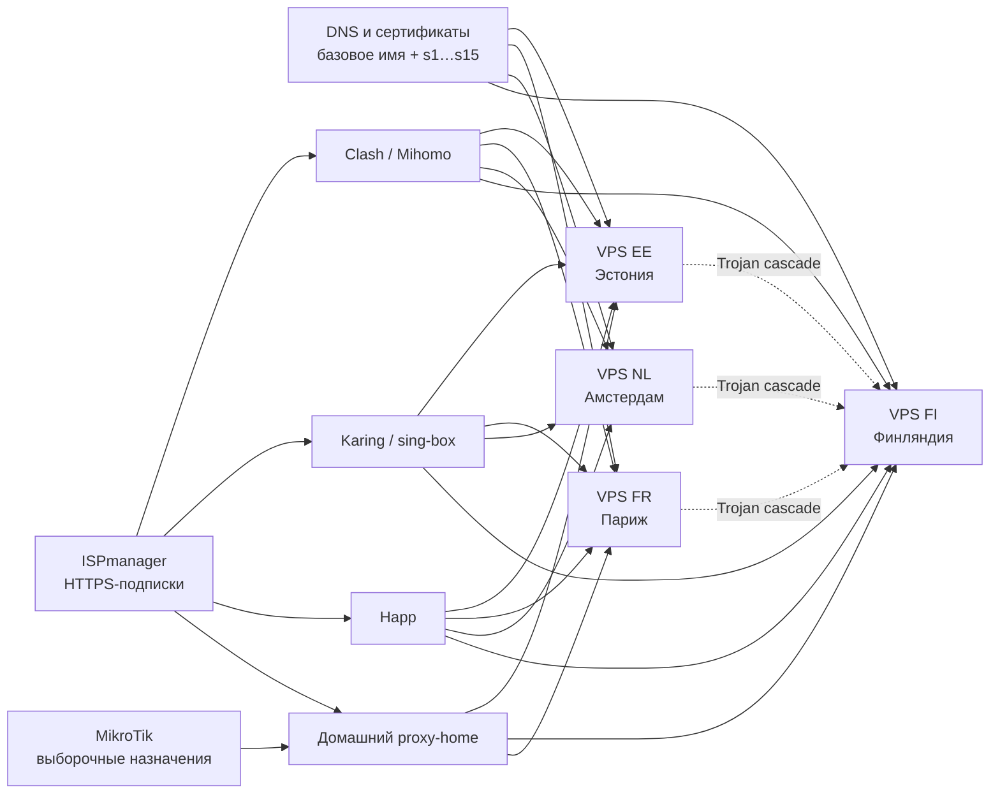
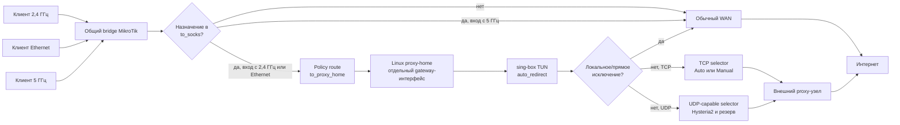

# VPN-инфраструктура и выборочное проксирование дома

Обезличенная архитектура нескольких VPS, DNS/подписок на ISPmanager,
клиентских профилей и домашнего шлюза MikroTik + Linux/sing-box. Это описание
связей и политик, а не готовый конфиг для импорта. Актуально на сентябрь 2026.
Реальные адреса, домены подписок, SSID, учётные данные и токены намеренно
исключены.

## Общая архитектура

Здесь EE/FR/NL/FI — только роли узлов, не их имена в публичном DNS.
Амстердам сохранён в клиентских профилях и артефактах, но не входит в
текущую автоматическую цепочку домашнего шлюза.

### DNS, TLS и публикация на ISP

У каждого узла есть базовое имя с A-записью и алиасы `s1`–`s15` через CNAME.
Сертификат покрывает базовое имя и эти алиасы. Алиас указывает на тип входа,
поэтому клиентские профили можно пересобирать по единой схеме на разных VPS.
Только WebSocket + TLS на `s1` допускает проксирование через Cloudflare;
остальные протоколы требуют прямой DNS-записи до VPS.

На отдельном HTTPS-сайте ISPmanager публикуются **разные форматы подписок**:
Clash/Mihomo JSON, Karing/sing-box JSON, Happ-ссылки и профили для домашнего
`proxy-home`. Публикация подписки не равна DNS маршрутизации: DNS ведёт к VPS,
а HTTPS-файл сообщает клиенту список выходов и правила выбора. Локальные
настройки TUN, секреты API и учётные данные не входят в публичный профиль
домашнего шлюза.

Поток изменений: проверенные артефакты серверов → генератор клиентских
профилей → проверка JSON и совместимости → каталог публикации ISPmanager →
загрузка клиентами по HTTPS. Панель домашнего шлюза применяет профиль только
после проверки формата и локальных конфигов sing-box/Xray и создания backup.

### Привязка входов на VPS

| Алиас | Вход | Реализация |
| --- | --- | --- |
| `s1` | VLESS + WebSocket + TLS | sing-box; единственный Cloudflare-совместимый вход |
| `s2` | VLESS + REALITY Vision | sing-box |
| `s3` | VLESS + REALITY gRPC | sing-box |
| `s4` | AnyTLS | sing-box |
| `s5` | VLESS + REALITY XHTTP | отдельный Xray |
| `s6` | Hysteria2 | sing-box, UDP |
| `s7` | TUIC v5 | sing-box, UDP |
| `s8` | NaiveProxy | sing-box |
| `s9` | Shadow-TLS v3 | sing-box; нет готового одиночного клиентского профиля |
| `s10` | Trojan Cascade | sing-box; промежуточный узел → Финляндия |
| `s11`–`s15` | Резерв | пока не назначены |

В схеме намеренно нет реальных портов, SNI/маскировочных имён, ключей REALITY,
паролей и UUID. У разных узлов собственные криптографические данные; нельзя
копировать секреты одного VPS в клиентский профиль другого. Исторический
нестабильный узел не входит в поддерживаемые подписки.

### Совместимость клиентских профилей

| Клиент | Включённые типы выходов | Исключения |
| --- | --- | --- |
| Clash Verge / Mihomo | WS, Vision, gRPC, AnyTLS, XHTTP, Hysteria2, Trojan Cascade | NaiveProxy и Shadow-TLS |
| Karing / sing-box | WS, Vision, gRPC, AnyTLS, Hysteria2, TUIC, NaiveProxy, Trojan Cascade | XHTTP и Shadow-TLS |
| Happ | Отдельная подписка ссылками | Поддержка зависит от сборки клиента |
| Домашний `proxy-home` | Отдельные профили Manual/Auto и неизменяемое ядро шлюза | Не является обычным мобильным JSON-профилем |

XHTTP выполняется локальным Xray, поскольку используемая версия sing-box не
принимает соответствующий outbound. Обычный HTTP-выход Clash не заменяет
NaiveProxy padding; поэтому NaiveProxy не добавляется в Clash-профиль.

## Домашняя схема

Обе радиосети и Ethernet остаются в одном bridge, IP-сети и DHCP. Поэтому
устройства видят друг друга; различается только выход для выбранных
назначений. При переходе между 2,4 и 5 ГГц активное соединение может
переподключиться из-за смены внешнего маршрута.

## Привязка политик

| Источник | Назначение из `to_socks` | Остальные назначения |
| --- | --- | --- |
| Wi-Fi 2,4 ГГц (`wlan1`) | Через `proxy-home` | Напрямую через WAN |
| Ethernet LAN | Через `proxy-home` | Напрямую через WAN |
| Wi-Fi 5 ГГц (`wlan2`) | Напрямую через WAN | Напрямую через WAN |
| Сам MikroTik | Только явно выбранные служебные запросы через `proxy-home` | Напрямую |

На 5 ГГц узкое mangle-исключение по `in-bridge-port=wlan2` стоит **выше**
общего правила policy routing для `to_socks`. Выделенная таблица маршрутизации
указывает на gateway-интерфейс Linux-хоста, а не на внутренний адрес его TUN.
Трафик, которому нужен `proxy-home`, исключён из FastTrack. Старый способ
перехвата через NAT/SOCKS не включается одновременно с policy routing.

Список `to_socks` пополняется как точными записями, так и DNS FWD-правилами.
Это **не строгий allowlist**: только по таблице ниже нельзя доказать, что
через шлюз не проходит другой трафик. Для точного аудита нужны текущие
DNS FWD-правила, address-list и счётчики MikroTik.

## Сервисы

Следующие сервисы учитываются в выборочной политике или её проверках.
Проксирование конкретного потока зависит от попадания его IP в `to_socks` и
от интерфейса клиента по таблице выше.

| Группа | Особенность |
| --- | --- |
| Telegram | Адреса дата-центров и доменные правила; сообщения, звонки и медиа идут одной политикой. Для сводки самого роутера предусмотрено отдельное output-правило. |
| Instagram / Meta | HTTPS/TCP следует общему TCP selector. Для нестабильного QUIC на выбранных Meta-назначениях применяется отказ UDP, чтобы клиент повторил соединение по TCP. |
| YouTube | Выборочное проксирование по доменным и IP-правилам; отдельно проверяется доступность медиа-узла. |
| ChatGPT / Codex, Gemini | Проверяются веб-интерфейс, API и связанные точки входа; фактическая маршрутизация определяется `to_socks`. |
| MyDyson, Grok, Claude, Suno | Выборочные доменные записи и проверки доступности. |
| WhatsApp, TikTok, Microsoft 365 / Outlook, Canva, 2ip | Входят в действующий набор DNS-правил или точных записей; охват нужно сверять с текущим DNS FWD. |

На самом Linux-хосте работают панель Auto/Manual и отдельная служебная
Telegram-сводка. Панель доступна только из LAN, а её локальный API и
диагностический SOCKS-вход не публикуются наружу.

## Выбор выходного маршрута

- TCP выбирается по **доступности**, не по минимальной задержке. Текущий
  исправный выход удерживается. Проверка запускается каждые 15 секунд;
  переключение происходит после трёх последовательных неудач (примерно
  45 секунд).
- Автоматическая цепочка начинается с двух TCP-маршрутов в Эстонии; затем
  идут резервы в Финляндии и Париже. Отдельные нестабильные протоколы не
  включены в активную автоматическую цепочку.
- UDP/QUIC имеет отдельный selector из UDP-совместимых выходов: основной
  Hysteria2 в Финляндии, резерв — в Париже. Проверка UDP выполняет настоящий
  DNS-запрос через SOCKS5 UDP ASSOCIATE; успешный TCP-запрос не считается
  доказательством работы UDP.
- Manual закрепляет выбранный выход. Предпросмотр профиля и замер кандидатов
  выполняются изолированно и не меняют рабочий gateway до применения.

## Наблюдение и восстановление

Ежеминутные HTTPS HEAD-проверки через текущий маршрут охватывают Instagram,
YouTube, Telegram, ChatGPT/Codex, Gemini и остальные группы выше; отдельно
проверяется UDP. Результаты, задержки TLS и история ошибок видны в LAN-панели.
HTTP 403/404 означает, что TLS и сервер ответили, но **не** подтверждает вход
в аккаунт, загрузку комментариев или воспроизведение видео. Ошибка одного
приложения фиксируется отдельно и не переключает весь дом на другой выход.

Перед изменениями на роутере и шлюзе создаётся проверенная локальная точка
отката. На роутере актуальные файлы восстановления хранятся в постоянном
хранилище; старые копии удаляются только после сверки локальных хешей.
Перед перезапуском sing-box/Xray их конфигурации проходят встроенные проверки.

## Что не публикуется

В этот пример не входят реальные IP-подсети, адреса шлюза или VPS, домены и
URL подписок, имена Wi-Fi, пользовательские идентификаторы, живые конфиги,
бэкапы, логи клиентов, пароли, ключи, токены и идентификаторы чатов.
